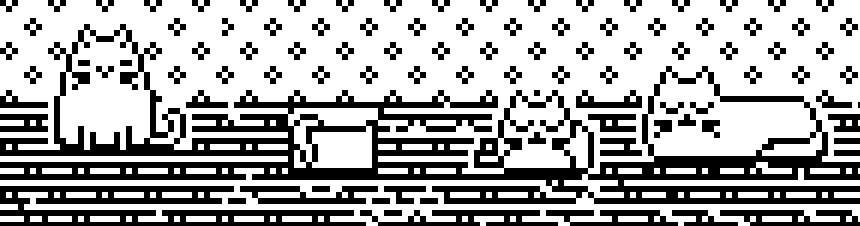

# mimezis_reminder 
A simple self hosted web app.

I had a problem with completing my tasks, even if they are menial. When you complete all tasks on a specifis list mimezis becomes happy. 
I hope this will motivate me to do stuff and get my life in order. 
Mimezis = cat

### Usage
To use it upload the files to a webserver that supports .php, and open index.php. 
When adding the first todo, a json file is created. Currently there are 4 different lists that can be opened by clicking on one of four mimezis.

